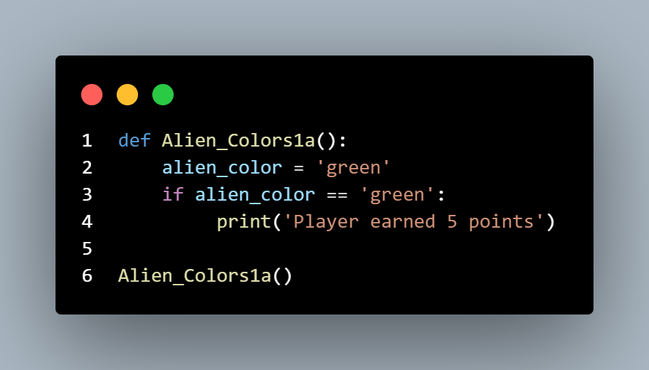
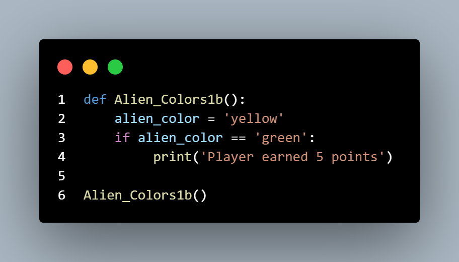

# Exercises I practiced

## if statements

### Exercise 1

**Alien Colors #1:** Imagine an alien was just shot down in a game. Create a 
variable called alien_color and assign it a value of 'green', 'yellow', or 'red'. 
•	 Write an if statement to test whether the alien’s color is green. If it is, print 
a message that the player just earned 5 points. 
•	 Write one version of this program that passes the if test and another that fails. (The version that fails will have no output.)

***Solution One***

***Solution Two***

### Exercise 2

**Alien Colors #2:** Choose a color for an alien as you did in Exercise 5-3, and 
write an if-else chain. 
•	 If the alien’s color is green, print a statement that the player just earned 
5 points for shooting the alien. 
•	 If the alien’s color isn’t green, print a statement that the player just earned 10 points. 
•	 Write one version of this program that runs the if block and another that 
runs the else block

***Solution One***

***Solution Two***