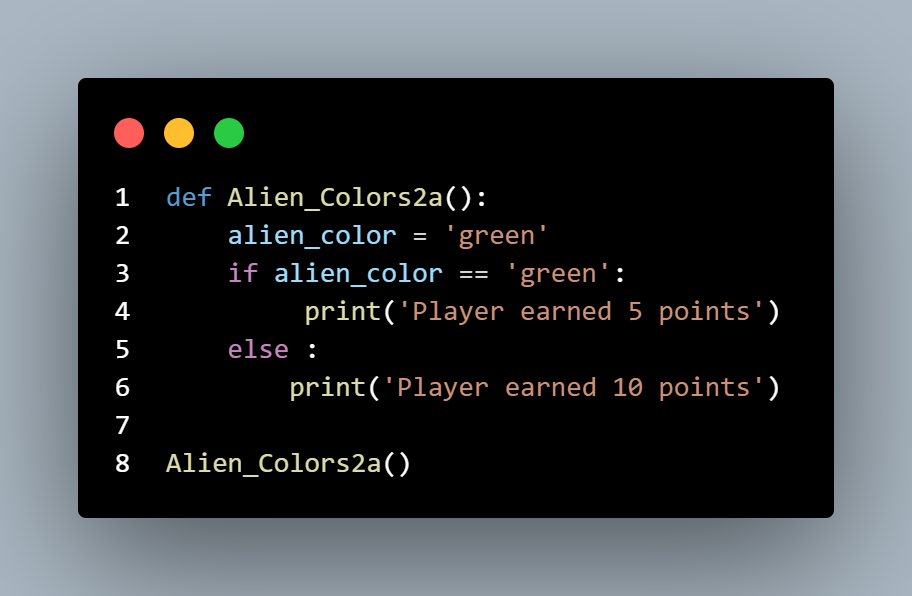
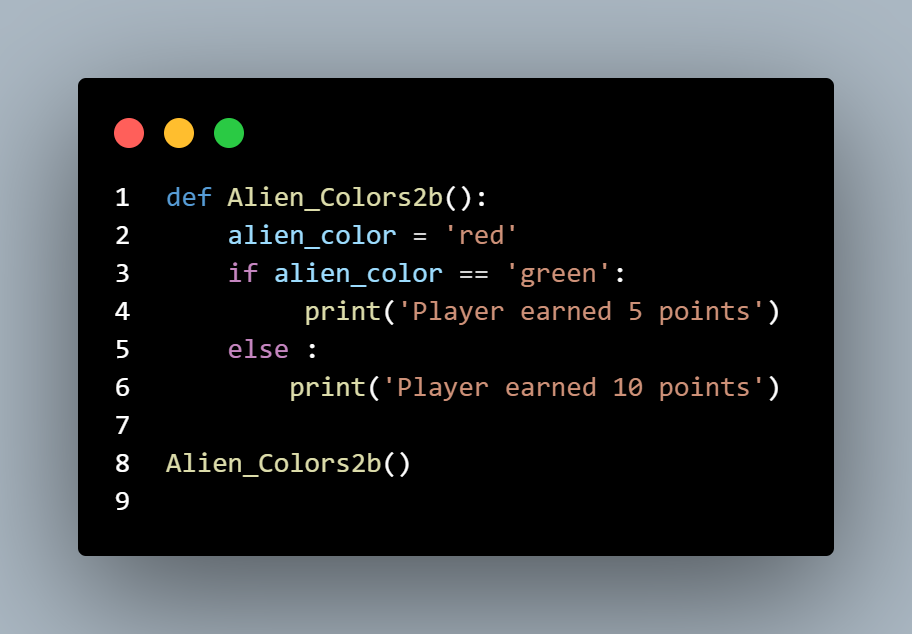
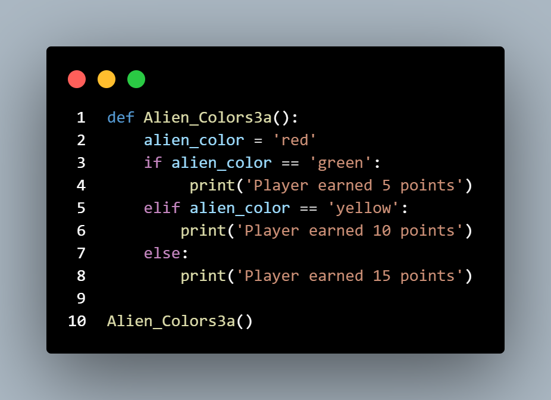
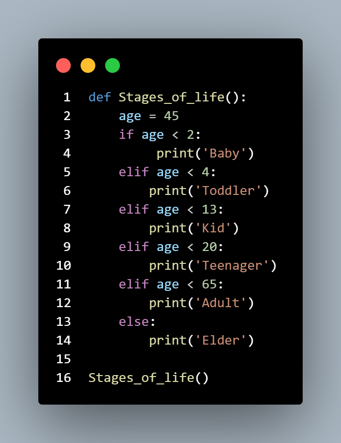
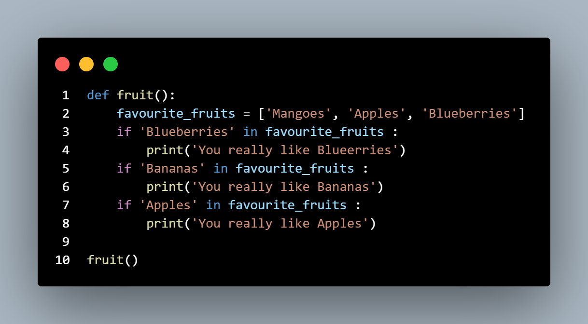
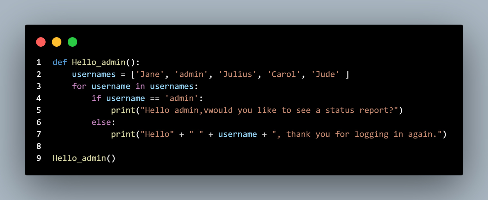
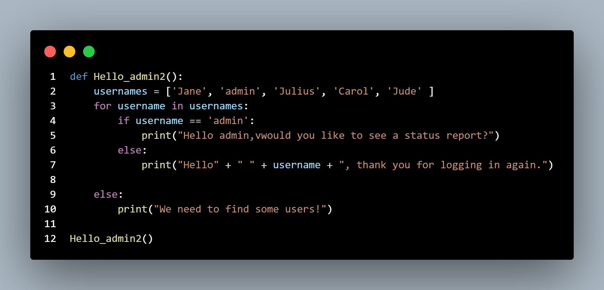
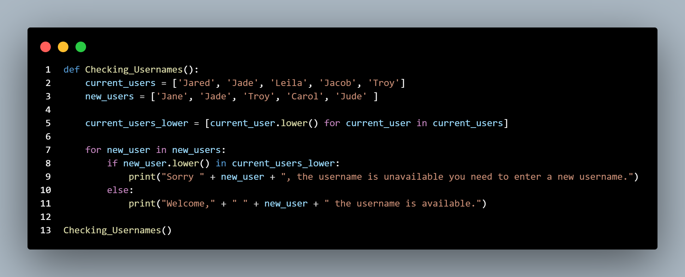
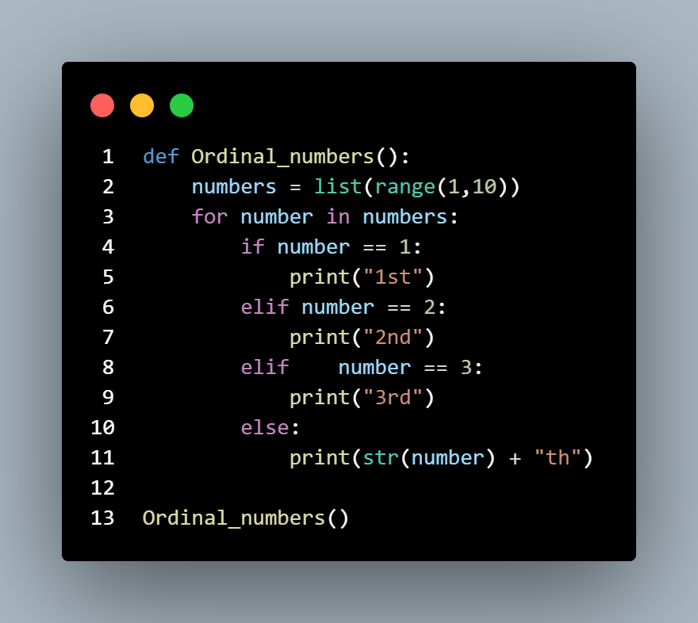

# Exercises I practiced

## if statements

### Exercise 1

**Alien Colors #1:** Imagine an alien was just shot down in a game. Create a 
variable called alien_color and assign it a value of 'green', 'yellow', or 'red'. 
•	 Write an if statement to test whether the alien’s color is green. If it is, print 
a message that the player just earned 5 points. 
•	 Write one version of this program that passes the if test and another that fails. (The version that fails will have no output.)

***Solution One***

***Solution Two***

### Exercise 2

**Alien Colors #2:** Choose a color for an alien as you did in Exercise 5-3, and 
write an if-else chain. 
•	 If the alien’s color is green, print a statement that the player just earned 
5 points for shooting the alien. 
•	 If the alien’s color isn’t green, print a statement that the player just earned 10 points. 
•	 Write one version of this program that runs the if block and another that 
runs the else block

***Solution One***

***Solution Two***

### Exercise 3

**Alien Colors #3:** Turn your if-else chain from Exercise 5-4 into an if-elif-else chain. 
•	 If the alien is green, print a message that the player earned 5 points. 
•	 If the alien is yellow, print a message that the player earned 10 points. 
•	 If the alien is red, print a message that the player earned 15 points. 
•	 Write three versions of this program, making sure each message is printed 
for the appropriate color alien.

***Solution***

### Exercise 4

**Stages of Life:** Write an if-elif-else chain that determines a person’s 
stage of life. Set a value for the variable age, and then:  
•	 If the person is less than 2 years old, print a message that the person is 
a baby. 
•	 If the person is at least 2 years old but less than 4, print a message that 
the person is a toddler. 
•	 If the person is at least 4 years old but less than 13, print a message that 
the person is a kid. 
•	 If the person is at least 13 years old but less than 20, print a message that 
the person is a teenager. 
•	 If the person is at least 20 years old but less than 65, print a message that 
the person is an adult. 
•	 If the person is age 65 or older, print a message that the person is an 
elder. 

***Solution***

### Exercise 5

**Favorite Fruit:** Make a list of your favorite fruits, and then write a series of 
independent if statements that check for certain fruits in your list. 
•	 Make a list of your three favorite fruits and call it favorite_fruits. 
•	 Write five if statements. Each should check whether a certain kind of fruit 
is in your list. If the fruit is in your list, the if block should print a statement, 
such as You really like bananas!

***Solution***

### Exercise 6

**Hello Admin:** Make a list of five or more usernames, including the name 
'admin'. Imagine you are writing code that will print a greeting to each user 
after they log in to a website. Loop through the list, and print a greeting to 
each user: 
•	 If the username is 'admin', print a special greeting, such as Hello admin, 
would you like to see a status report? 
•	 Otherwise, print a generic greeting, such as Hello Eric, thank you for logging in again.

***Solution***

### Exercise 7

**No Users:** Add an if test to hello_admin.py to make sure the list of users is 
not empty. 
•	 If the list is empty, print the message We need to find some users! 
•	 Remove all of the usernames from your list, and make sure the correct 
message is printed.

***Solution***

### Exercise 8

**Checking Usernames:** Do the following to create a program that simulates 
how websites ensure that everyone has a unique username. 
•	 Make a list of five or more usernames called current_users. 
•	 Make another list of five usernames called new_users. Make sure one or 
two of the new usernames are also in the current_users list. 
•	 Loop through the new_users list to see if each new username has already 
been used. If it has, print a message that the person will need to enter a 
new username. If a username has not been used, print a message saying 
that the username is available. 
•	 Make sure your comparison is case insensitive. If 'John' has been used, 
'JOHN' should not be accepted.

***Solution***

### Exercise 9

**Ordinal Numbers:** Ordinal numbers indicate their position in a list, such 
as 1st or 2nd. Most ordinal numbers end in th, except 1, 2, and 3. 
•	 Store the numbers 1 through 9 in a list. 
•	 Loop through the list. 
•	 Use an if-elif-else chain inside the loop to print the proper ordinal ending for each number. Your output should read "1st 2nd 3rd 4th 5th 6th 7th 8th 9th", and each result should be on a separate line.

***Solution***

